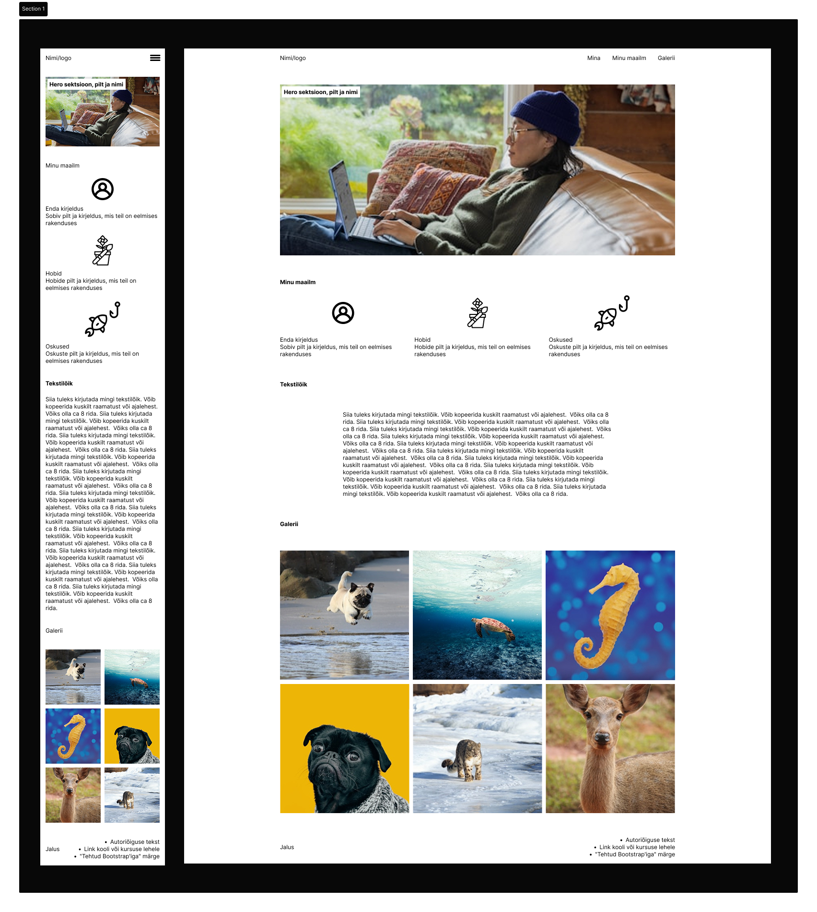

#4. seminar
[Seminari video, kahjuks helita](https://www.youtube.com/watch?v=wkY7_lxf5Es)

## Seminari sisu
- Kodutööde tagasiside
- CSS-i eeltöötlejad (preprotsessors)
- SCSS
- Bootstrap
- Kodutöö tutvustus

### Sissejuhatus (5 min)
### Kodutööde tagasiside (30 min) 
- Peamised puudused kodutöödes (10 min)
- Kuidas jagada kaasõppijatele kodutööde tagasisidet linterid ja AI (20 min)

### Preprotsessorid (5 min)
    - Mis on preprotsessorid? (näited)
    CSS preprotsessorid on tööriistad, mis võimaldavad kirjutada CSS koodi laiendatud süntaksiga, mis hiljem kompileeritakse tavaliseks CSS-iks. Preprotsessorid lisavad CSS-ile funktsionaalsust, muutes koodi kirjutamise efektiivsemaks ja paremini hallatavaks.

    **Peamised eelised:**
    - Muutujate kasutamine
    - Pesastatud reeglid (nesting) – nüüd ka css-is
    - Funktsioonid ja operaatorid
    - Mixinid ja laiendused
    - Koodi jagamine mooduliteks

#### SCSS
##### Tutvustus ja seadistus oma arvutis (40 min)
**Eeldused**
- Node.js installitud (kõige lihtsam)
- VS Code (vms IDE)

**SCSS (Sassy CSS ehk Syntactically Awesome Style Sheet)**
- SCSS kui CSS preprotsessor, mis laiendab CSS-i funktsionaalsust
- Koodi kompileerimine SCSS-ist CSS-iks
https://sass-lang.com/

**SCSS Põhiomadused**
- CSS-iga ühilduv süntaks
- Muutujate defineerimine `$` sümboliga (nt `$primary-color`, `$spacing`)
- Pesastatud reeglid (nesting) koodi struktuuri paremaks organiseerimiseks
- Matemaatilised operatsioonid (nt `calc($spacing * 0.5)`)
- Värvidega töötamise funktsioonid (nt `darken()`, `lighten()`)

**Partials**
- Failinimed algavad alakriipsuga (nt `_variables.scss`, `_mixins.scss`)
- Koodi jagamine loogilisteks mooduliteks
- Importimine `@use` direktiiviga nimeruumidega
- Koodi taaskasutatavuse ja hooldatavuse parandamine

**Mixinid**
- Defineerimine `@mixin` direktiiviga
- Importimine `@use`direktiiviga
- Kasutamine `@include` direktiiviga
- Parameetrite kasutamine (nt `@mixin button-style($bg-color)`)
- Koodi kordumise vähendamine
- Koodi parema hallatavuse tagamine

**SCSS Funktsioonid**
- Kohandatud funktsioonide loomine `@function` direktiiviga
- Sisseehitatud funktsioonide kasutamine (nt `darken()`, `lighten()`)
- Tingimuslausete kasutamine funktsioonides (`@if`, `@else`)
- Dünaamiliste väärtuste loomine

**Sass Moodulid**
- Sisseehitatud moodulite kasutamine (`sass:math`, `sass:color`)
- Moodulite importimine `@use` direktiiviga
- Moodulite funktsioonide kasutamine (nt `math.div()`)

#### Iseseisev töö tunnis (40 min)
- Loo näidise järgi värvi ja suuruse muutujatega ning "partialidega" väikerakenduse algus. Hilisem osa jääb ühels kodutööks.  
[Ülesande kirjeldus](work/simple-card/README.md)

#### BEM Metoodika (20 min)
- Block-Element-Modifier nimetamise konventsioon
- Selektorite struktureerimine SCSS-is BEM metoodika järgi
- Ampersandi (`&`) kasutamine pesastatud reeglites BEM-i implementeerimiseks 

#### Bootstrap (30 min)
Seminaris tutvutakse sissejuhatava osaga, mis loob eeldused koduse iseseisva töö jaoks – bootstrapi seadistamine ja üldine tutvustus.

## Koduse töö selgitus (20 min)
### Üldine
- Uued tudengipaarid (code review) failis [studen_pairs.md](student_pairs.md)
- Refleksiooni kohta (`protsess.md`)

### 1. Seminaris alustatud kaardiga html-lehe lõpetamine.

[**Ülesande juhend**](work/simple-card/README.md)

### 2. Seekordne teine ülesanne on mõneti keerukam – iseseisvalt Bootstrapi tundma õppimine
Selleks tuleb teil luua aadressil https://www.figma.com/design/6KOklRts6YVhXPHStdvocg/homework?node-id=0-1&t=4wtKuX6sGwp9xDvN-1 oleva madalakvaliteedilise visandi järgi päris leht.  Kasutage samu sisuosasid, mis teil juba CV-s olemas. Mõned asja tulevad lisaks.  
Kui Figma linki ei näe, 

**NB! See on visand, mitte lõpptulemus. Ehk, et te peate ikka selles võtmes, mida Bootstrap pakub tegema**

[Detailsem kirjeldus](yl_kirjeldus.md)

- värve muutma ei pea, võib kasutada Bootstrapi vaikimis värve.
- juhend asub aadressil: https://getbootstrap.com/docs/5.3/layout/containers/  
Vasakus servas asuvast menüüst leiate vajaliku.   
Märksõnad, milles lähtuda, mida otsida:
- Containers
- Grid
- Images
- Gard
- Buttons
- Navbar
- Display
- Colors
- Background
- Flex
- jne

Samm-sammuline juhis seminaris tehtu kohta, [**on ka siin**](workbootstrap/bootstrap-cdn/README.md)

#### NB! Ülesande lahendamise osaks on seekord ka foorum githubis, kuhu te peate oma avastused kamba peale kirja saama. Mõte on selles, et kui keegi lahenduse leiab, siis ta jagab seda teistega või kui keegi on hädas, siis ta püstitab vastava kommentaariga teema ja teised eeldatavasti vastavad talle. 

Nii on lihtsam kui omaette pusides ja mitte hakkama saades.

Foorumi aadress: https://github.com/tluhk/Veebirakendused-ja-nende-loomine/discussions/2

Alustage ülalt alla lahendamist – navigatsioon, hero, muud plokid. Kui ei jõua kõike valmis, pole probleemid. Oluline on kogemuse jagamine foorumis ja töö käigus õppimine.

`protsess.md` ka seekord koht, kuhu lisage oma ajakulu ja protsessikirjeldus, kuid seekord, kes on aktiivsemalt osalenud githubi foorumis, võib protsessi faili lisada vaid märkuse, et kirjutas peamise osa foorumisse. Ajakulu on siiski vajalik. Refleksiooni võite muidugi lisada rahulolematuse või rahulolu üldise töökorraldusega, mida nt ei taha mujal jagada.