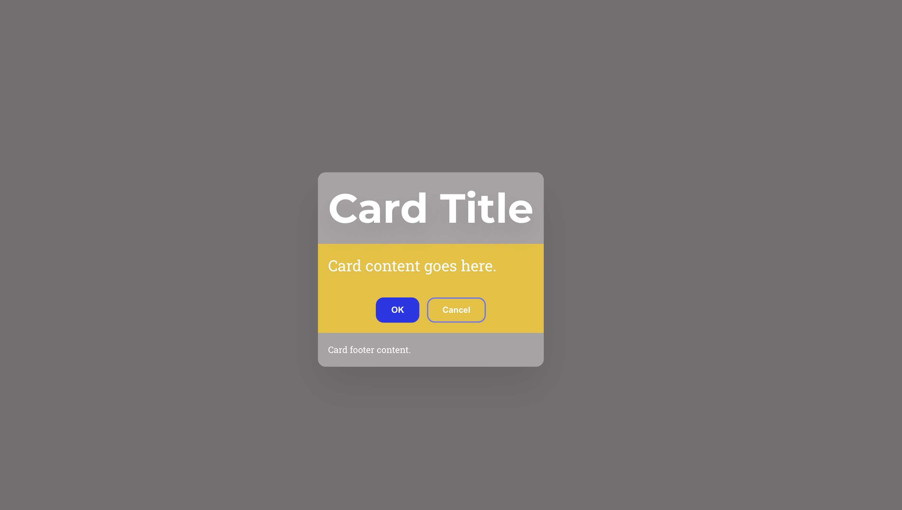

# 4. seminar
[Seminari video, kahjuks helita](https://www.youtube.com/watch?v=wkY7_lxf5Es)

## Seminari eesmärgid
- Tutvuda CSS eeltöötlejate põhimõtete ja eelistega
- Õppida SCSS-i kasutamist ja struktuuri veebiarenduses
- Tutvuda BEM metoodikaga koodi organiseerimiseks
- Anda sissejuhatus Bootstrap raamistikku

## Õpiväljundid
- Õppija selgitab CSS eeltöötlejate eeliseid traditsioonilise CSS-i ees
- Tunneb SCSS-i põhiomadusi, süntaksit ja struktuuri
- Loob ja struktureerib SCSS faile, kasutades muutujaid ja partialeid
- Rakendab BEM metoodikat koos SCSS-iga
- Tunneb Bootstrapi põhikomponente ja nende kasutamist

## Tehnilised vahendid
- Node.js (SCSS kompileerimiseks)
- VS Code või muu koodiredaktor
- SCSS kompilaator
- Bootstrap raamistik (CDN)

## Sisukord
- [Seminari ülevaade](#4-seminar)
- [Sessioonid](#sessioon-1-sissejuhatus-ja-kodutööde-tagasiside)
  - [1. Sissejuhatus ja kodutööde tagasiside](#sessioon-1-sissejuhatus-ja-kodutööde-tagasiside)
  - [2. CSS-i eeltöötlejad](#sessioon-2-css-i-eeltöötlejad)
  - [3. SCSS tutvustus ja seadistus](#sessioon-3-scss-tutvustus-ja-seadistus)
  - [4. BEM metoodika](#sessioon-4-bem-metoodika)
  - [5. Bootstrap](#sessioon-5-bootstrap)
- [Kodutöö](#kodutöö)

## Sessioon 1: Sissejuhatus ja kodutööde tagasiside
- **Kestus:** 35 minutit
- **Eesmärk:** Tutvustada seminari ja anda tagasisidet kodutöödele
- **Teemad:**
  - Seminari sisu tutvustus
  - Peamised puudused kodutöödes (10 min)
  - Kuidas jagada kaasõppijatele kodutööde tagasisidet linterid ja AI (20 min)

## Sessioon 2: CSS-i eeltöötlejad
- **Kestus:** 5 minutit
- **Eesmärk:** Tutvustada CSS preprotsessorite põhimõtteid
- **Teemad:**
  - Mis on preprotsessorid ja milleks neid kasutatakse
  - Peamised eelised:
    - Muutujate kasutamine
    - Pesastatud reeglid (nesting) – nüüd ka CSS-is
    - Funktsioonid ja operaatorid
    - Mixinid ja laiendused
    - Koodi jagamine mooduliteks

## Sessioon 3: SCSS tutvustus ja seadistus
- **Kestus:** 40 minutit
- **Eesmärk:** Õppida SCSS-i põhiomadusi ja seadistust
- **Teemad:**
  - Eeldused: Node.js ja VS Code
  - SCSS kui CSS preprotsessor
  - Koodi kompileerimine SCSS-ist CSS-iks
  - Põhiomadused:
    - CSS-iga ühilduv süntaks
    - Muutujate defineerimine
    - Pesastatud reeglid
    - Matemaatilised operatsioonid
    - Värvidega töötamise funktsioonid
  - Partials, Mixinid, Funktsioonid ja Moodulid
- **Praktiline ülesanne:** Väikerakenduse alguse loomine värvi ja suuruse muutujatega ning "partialidega"

## Sessioon 4: BEM metoodika
- **Kestus:** 20 minutit
- **Eesmärk:** Tutvustada BEM nimetamise konventsiooni
- **Teemad:**
  - Block-Element-Modifier nimetamise konventsioon
  - Selektorite struktureerimine SCSS-is BEM metoodika järgi
  - Ampersandi (`&`) kasutamine pesastatud reeglites BEM-i implementeerimiseks

## Sessioon 5: Bootstrap
- **Kestus:** 30 minutit
- **Eesmärk:** Tutvustada Bootstrapi raamistikku
- **Teemad:**
  - Bootstrapi seadistamine
  - Üldine tutvustus ja põhielemendid
Samm-sammuline juhis seminaris tehtu kohta, [**on ka siin**](workbootstrap/bootstrap-cdn/README.md)

## Kodutöö
### Üldine
- Uued tudengipaarid (code review) failis [studen_pairs.md](student_pairs.md)
- Refleksiooni kohta (`protsess.md`)

### 1. Seminaris alustatud kaardiga html-lehe lõpetamine
- [Ülesande juhend](work/simple-card/README.md)
- Näidis:

- Lõpetada seminaris alustatud kaardiga veebileht

### 2. Bootstrapi iseseisvalt tundma õppimine
- Luua Figma visandi järgi päris leht, kasutades Bootstrap raamistikku
- Kasutada CV-s olevaid sisuosasid
- Põhimõtted:
  - Värve muutma ei pea, võib kasutada Bootstrapi vaikimisi värve
  - Olulised märksõnad: Containers, Grid, Images, Card, Buttons, Navbar, Display, Colors, Background, Flex jne

### Foorum ja refleksioon
- Foorumis osalemine GitHubis: https://github.com/tluhk/Veebirakendused-ja-nende-loomine/discussions/2
- `protsess.md` failis lisada ajakulu ja protsessikirjeldus (või märkus, et peamine osa kirjutati foorumisse)

## Hindamismaatriks kodutööle

See hindamismaatriks aitab hinnata kodutöö erinevaid aspekte järgneva skaalaga:
- **Puudub (0p):** lahendus puudub või ei ole esitatud.
- **On olemas (3p):** lahendus on esitatud, kuid on mitte täielikult või minimaalselt realiseeritud.
- **On tehtud nii nagu peab (4p):** lahendus vastab täielikult ülesande kirjeldatud nõuetele.
- **On lisatud omalt poolt lisasid (5p):** tööle on lisatud täiendavaid ja läbimõeldud lahendusi, mis tõstavad töö kvaliteeti.

| Kriteerium | Puudub (0p) | On olemas (3p) | On tehtud nii nagu peab (4p) | On lisatud omalt poolt lisasid (5p) |
| ---------- | ------ | ------------- | -------------------------- | ---------------------------------- |
| **SCSS kaardi ülesanne** | Ülesanne on tegemata või poolik. | Kaardi põhistruktuur on olemas, kuid SCSS kasutamine on puudulik või sisaldab vigu. | SCSS on korrektselt struktureeritud, muutujad ja partialid on kasutatud vastavalt nõuetele. | Lisatud on täiendavaid funktsionaalsusi (nt hover efektid, mixinid, funktsioonid) või visuaalseid täiustusi. |
| **Bootstrap leht** | Bootstrap leht on tegemata või olulised osad puuduvad. | Põhikomponendid on olemas, kuid paigutus või seadmetundlik disain pole täielik. | Leht on seadmetundlik ja kasutab korrektselt Bootstrapi komponente. | Lisatud on täiendavaid interaktiivseid elemente, animatsioone või kohandatud Bootstrap komponente. |
| **Refleksioon ja ajakulu** | Refleksioon ja ajakulu dokumentatsioon puudub. | Refleksioon või ajakulu on kirja pandud, kuid pinnapealselt. | Refleksioon ja ajakulu on põhjalikud ning informatiivse sisuga. | Refleksioon sisaldab sügavat analüüsi, konstruktiivseid ettepanekuid või lahendusi kogetud probleemidele. |
| **Git kasutamine** | Failid on lisatud muul viisil kui Git või töövoog pole selge. | Git on kasutatud, kuid commit sõnumid pole informatiivsed. | Git töövoog on selge ja commit sõnumid on informatiivsed. | Git töövoog on professionaalne, hästi struktureeritud ja järgib häid tavasid. |
| **GitHub foorum (boonus)** |   |   | Foorumis on aktiivselt osaletud, jagades kogemusi ja aidates teisi. | Foorumis on loodud väärtuslikku sisu, mis on aidanud oluliselt kaasa kogukonna õppimisele. |

Maksimumtulemus põhiülesannete eest on 20 punkti. GitHub foorumis osalemine võib anda täiendavalt kuni 5 boonuspunkti.

Kodune töö on aluseks järgmisele seminarile: [Seminari 5](jarelseminar/README.md)

## Ennastjuhtiva õppija kujundamise strateegiad

### 1. Kogemuspõhine õppimine
- Võimalus rakendada SCSS-i ja Bootstrapi põhimõtteid praktilistes ülesannetes
- Teadmiste rakendamine ja testimine reaalsetes projektides
- Oma kogemuste jagamine GitHub foorumis teistega

### 2. Probleemipõhine õppimine
- Seadmetundliku veebilehe loomine Bootstrapi abil
- SCSS struktuuride loomine ja organiseerimine
- Tehniliste väljakutsete iseseisev lahendamine dokumentatsiooni abil

### 3. Ressursside otsimine ja hindamine
- Bootstrapi dokumentatsiooni iseseisev uurimine ja rakendamine
- Erinevate SCSS ressursside ja näidete hindamine ning kasutamine
- Leitud ressursside ja nende kasulikkuse jagamine GitHub foorumis

### 4. Metakognitsioon
- Oma õppimisprotsessi dokumenteerimine protsess.md failis
- Ajakulu jälgimine ja analüüsimine
- Takistuste ja lahenduste reflekteerimine

### 5. Koostöö ja vastastikune õpetamine
- Koodi ülevaatamine kaasõppijate töödes
- Tagasiside andmine ja konstruktiivsete ettepanekute tegemine
- Aktiivselt küsimustele vastamine ja oma teadmiste jagamine GitHub foorumis